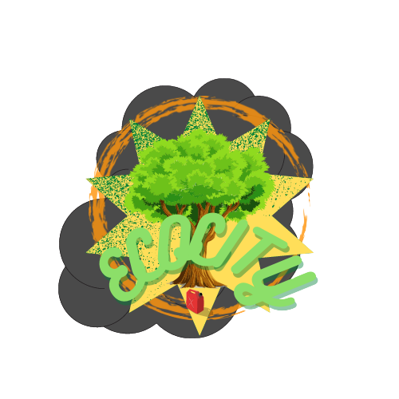

<div align="center">
  <a href="https://github.com/nicolas-stein/EcoCity">
    
  </a>
</div>

# EcoCity
## About The Project
Hello everyone, here you can found all the files to download and execute our game **EcoCity**. <br />
You can found the report about our projet at [*Rapport_Stein_Roussarie*](https://github.com/nicolas-stein/EcoCity/blob/master/Rapport_Stein_Roussarie.pdf). <br />
And if you want to know more about how to play and history look at [*Guide_de_jeu*](https://github.com/nicolas-stein/EcoCity/blob/master/Guide_de_jeu.pdf). <br />
To see the uml look [*UML_EcoCity*](https://github.com/nicolas-stein/EcoCity/blob/master/UML_EcoCity.png). <br />
We work a lot to make this project so we hope you going to love it. <br />

### Built With
- [QT](https://www.qt.io/ "QT")

## Getting Started
First you need a computer with Linux, Windows or MacOs. To get the files and play the game follow the instruction bellow.

### Prerequisites
To play at this game you will need QT librairie, or other.

## Installation
1. Clone the repo
  ```sh
  $ git clone https://github.com/nicolas-stein/EcoCity
  ```
 
2. Download QT
```sh
$ sudo apt-get update
```
```sh
$ sudo apt-get install build-essential
```
```sh
$ sudo apt install qt5-default
```

3. Compile the code
```sh
./compilator
```

4. Execute the code
  ```sh
  ./executable
  ```

## The Game
Now that you have launch the game, it time to play. You can share it with your friend and try to make the higher score possible.


